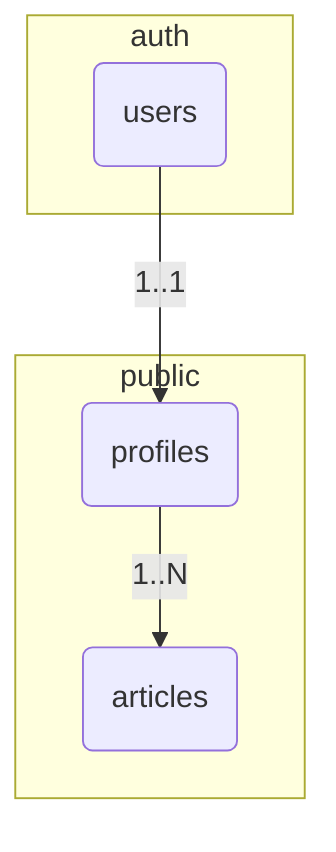

# System Patterns

_This document outlines the system architecture, key technical decisions, design patterns in use, and component relationships._

## Data Models and Entity-Relationship Diagram

### Core Entities

#### Profiles
Represents user-specific data, including their role. Linked to `auth.users` table.

**Attributes:**
- `id`: Foreign Key to `auth.users.id` (UUID)
- `role`: User role enum (`admin`, `user`)
- `created_at`: Creation timestamp (DateTime)
- `updated_at`: Last update timestamp (DateTime)

**Business Rules:**
- A profile is automatically created for each new user via a database trigger.
- The default role for a new user is `user`.
- The `role` attribute is used for access control throughout the application.

#### Articles
Represents blog articles.

**Attributes:**
- `id`: Unique identifier (UUID)
- `title`: Article title (Text)
- `content`: Full content of the article in Markdown (Text)
- `excerpt`: A short summary of the article (Text)
- `slug`: URL-friendly version of the title (Text, Unique)
- `status`: Article status enum (`draft`, `published`)
- `author_id`: Foreign Key to `profiles.id` (UUID)
- `published_at`: Timestamp when the article was published (DateTime)
- `created_at`: Creation timestamp (DateTime)
- `updated_at`: Last update timestamp (DateTime)

**Business Rules:**
- Only users with the `admin` role can create, update, or delete articles.
- `published` articles are visible to the public.
- `draft` articles are only visible to authenticated users (and primarily intended for admins).
- The `slug` is used for the article's URL (e.g., `/blog/[slug]`).

### Legacy Entities

#### Week
This table exists from a previous iteration of the project focused on scheduling. It is not currently in use.

### Entity Relationships

### Detailed Relationships

1.  **auth.users → profiles** (One-to-One)
    - Each user in `auth.users` has one corresponding profile in `public.profiles`.
    - The `profiles.id` is a foreign key to `auth.users.id`.
    - Deleting a user from `auth.users` will cascade and delete their profile.

2.  **profiles → articles** (One-to-Many)
    - One user (profile) can be the author of many articles.
    - The `articles.author_id` is a foreign key to `profiles.id`.
    - If a profile is deleted, the `author_id` on their articles is set to NULL.

## System Architecture

### Frontend Architecture

- **SvelteKit** with file-based routing and server-side rendering (SSR).
- **Component Structure:**
  - **Routes**: Each page is a Svelte component. Data is loaded in `+page.server.ts` or `+layout.server.ts`.
  - **Components**: Reusable UI elements are in `src/lib/components/`.
    - **Landing Page Components**: `Hero.svelte`, `Services.svelte`, `Pricing.svelte`, etc.
    - **Common Components**: `Header.svelte`, `Footer.svelte`, `AdminHeader.svelte`.
    - **Blog Components**: Components for listing and displaying articles.
    - **Admin Components**: UI for managing content, like the blog.

### Backend Architecture

- **Platform**: Supabase provides the database (PostgreSQL), authentication, and auto-generated APIs.
- **SvelteKit Server-Side**: SvelteKit's server-side capabilities (`.server.ts` files) are used as the primary backend logic layer.
    - **API Layer**: Form actions and API endpoints are implemented in `+page.server.ts` and `+server.ts` files respectively. This is used for login, registration, etc.
    - **Data Access Layer**: The `@supabase/supabase-js` client is used on the server-side to interact with the Supabase database.
    - **Authentication & Session Management**:
        - Authentication is handled by Supabase Auth.
        - Session state is managed centrally in `src/hooks.server.ts`, which retrieves the user session from cookies and makes it available to the application via `event.locals.session`.

### Server-Side Rendering (SSR) Strategy

- **Default Approach**: SSR is used for almost all pages to ensure fast initial loads and good SEO.
- **Data Loading**: `+page.server.ts` and `+layout.server.ts` files are used to fetch data from Supabase before a page is rendered.
- **Authentication**: Session management is handled on the server. Pages that require authentication check for a valid session in their `load` functions and redirect if necessary.
- **Form Handling**: SvelteKit's form actions are used for handling user input (e.g., login, registration, creating blog posts), which provides progressive enhancement out of the box.

## Key Design Patterns

#### Role-Based Access Control (RBAC)

- **Implementation**: Access control is implemented on both the server-side (in `load` functions and form actions) and at the database level (using PostgreSQL Row Level Security policies).
- **Server-Side**: `+page.server.ts` files check the user's role (from `event.locals.session`) before returning data or performing actions. For example, the `/admin` route checks for an 'admin' role.
- **Database-Side (RLS)**: Supabase policies restrict what data a user can access or modify. For example, only users with the `admin` role can insert or update rows in the `articles` table.

#### Session Management

- **Centralized Hook**: `src/hooks.server.ts` is the single source of truth for session handling on the server.
- **Data Flow**:
    1. A request comes in.
    2. The hook gets the access token from cookies.
    3. It uses the token to fetch the user's session from Supabase.
    4. The session and user profile are attached to `event.locals`.
    5. Server-side `load` functions and actions can now securely access user information.
    6. The session is passed to the client-side from the root `+layout.ts` for use in Svelte components.

#### Internationalization (i18n)

- **Library**: `sveltekit-i18n` is used for i18n.
- **Language Detection**: The user's language is detected on the server from the `Accept-Language` header in `src/routes/+layout.server.ts` to prevent the "language blink" effect.
- **Translations**: JSON files for each language are stored in `src/lib/i18n/`.
- **Usage**: A `t` store is used in components to display translated strings.

## Critical Implementation Paths

### User Authentication Flow

1.  User fills out login/register form.
2.  The form submits a POST request to a SvelteKit form action (`/login/+page.server.ts` or `/register/+page.server.ts`).
3.  The action validates the input and calls the appropriate Supabase Auth function (`signInWithPassword` or `signUp`).
4.  Supabase handles the authentication and, on success, sets auth cookies on the response.
5.  The user is redirected to their respective dashboard (`/user` or `/admin`).

### Blog Post Creation Flow (Admin)

1.  An admin navigates to the "Create Post" page (`/admin/blog/create`).
2.  They fill out the form with title, content, etc.
3.  The form is submitted to a form action in `+page.server.ts`.
4.  The action validates the data.
5.  It then uses the server-side Supabase client to insert a new row into the `articles` table. The database RLS policy ensures only an admin can do this.
6.  The admin is redirected to the blog management page.

### Public Blog Viewing Flow

1.  A user navigates to `/blog` or `/blog/[slug]`.
2.  The `load` function in `+page.server.ts` runs on the server.
3.  It queries the `articles` table for published posts. The database RLS policy ensures only `status = 'published'` articles are returned to anonymous users.
4.  The data is passed to the page component, which then renders the articles.
