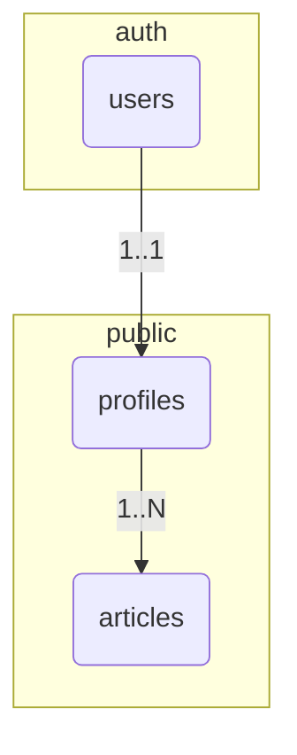

# System Patterns

_This document outlines the system architecture, key technical decisions, design patterns in use, and component relationships._

## Data Models and Entity-Relationship Diagram

### Core Entities

#### Profiles

Represents user-specific data, including their role. Linked to `auth.users` table.

**Attributes:**

- `id`: Foreign Key to `auth.users.id` (UUID)
- `role`: User role enum (`admin`, `user`)
- `created_at`: Creation timestamp (DateTime)
- `updated_at`: Last update timestamp (DateTime)

**Business Rules:**

- A profile is automatically created for each new user via a database trigger.
- The default role for a new user is `user`.
- The `role` attribute is used for access control throughout the application.

#### Articles

Represents blog articles.

**Attributes:**

- `id`: Unique identifier (UUID)
- `title`: Article title (Text)
- `content`: Full content of the article in Markdown (Text)
- `excerpt`: A short summary of the article (Text)
- `slug`: URL-friendly version of the title (Text, Unique)
- `status`: Article status enum (`draft`, `published`)
- `author_id`: Foreign Key to `profiles.id` (UUID)
- `published_at`: Timestamp when the article was published (DateTime)
- `created_at`: Creation timestamp (DateTime)
- `updated_at`: Last update timestamp (DateTime)

**Business Rules:**

- Only users with the `admin` role can create, update, or delete articles.
- `published` articles are visible to the public.
- `draft` articles are only visible to authenticated users (and primarily intended for admins).
- The `slug` is used for the article's URL (e.g., `/blog/[slug]`).

### Legacy Entities

#### Week

This table exists from a previous iteration of the project focused on scheduling. It is not currently in use.

### Entity Relationships



### Detailed Relationships

1.  **auth.users → profiles** (One-to-One)
    - Each user in `auth.users` has one corresponding profile in `public.profiles`.
    - The `profiles.id` is a foreign key to `auth.users.id`.
    - Deleting a user from `auth.users` will cascade and delete their profile.

2.  **profiles → articles** (One-to-Many)
    - One user (profile) can be the author of many articles.
    - The `articles.author_id` is a foreign key to `profiles.id`.
    - If a profile is deleted, the `author_id` on their articles is set to NULL.

## System Architecture

### Frontend Architecture

- **SvelteKit** with file-based routing and server-side rendering (SSR).
- **Component Structure:**
  - **Routes**: Each page is a Svelte component. Data is loaded in `+page.server.ts` or `+layout.server.ts`.
  - **Components**: Reusable UI elements are in `src/lib/components/`.
    - **Landing Page Components**: `Hero.svelte`, `Services.svelte`, `Pricing.svelte`, etc.
    - **Common Components**: `Header.svelte`, `Footer.svelte`, `AdminHeader.svelte`.
    - **Blog Components**: Components for listing and displaying articles.
    - **Admin Components**: UI for managing content, like the blog.

### Backend Architecture

- **Platform**: Supabase provides the database (PostgreSQL), authentication, and auto-generated APIs.
- **SvelteKit Server-Side**: SvelteKit's server-side capabilities (`.server.ts` files) are used as the primary backend logic layer.
  - **API Layer**: Form actions and API endpoints are implemented in `+page.server.ts` and `+server.ts` files respectively. This is used for login, registration, etc.
  - **Data Access Layer**: The `@supabase/supabase-js` client is used on the server-side to interact with the Supabase database.
  - **Authentication & Session Management**:
    - Authentication is handled by Supabase Auth.
    - Session state is managed centrally in `src/hooks.server.ts`, which retrieves the user session from cookies and makes it available to the application via `event.locals.session`.

### Server-Side Rendering (SSR) Strategy

- **Default Approach**: SSR is used for almost all pages to ensure fast initial loads and good SEO.
- **Data Loading**: `+page.server.ts` and `+layout.server.ts` files are used to fetch data from Supabase before a page is rendered.
- **Authentication**: Session management is handled on the server. Pages that require authentication check for a valid session in their `load` functions and redirect if necessary.
- **Form Handling**: SvelteKit's form actions are used for handling user input (e.g., login, registration, creating blog posts), which provides progressive enhancement out of the box.

## Key Design Patterns

#### Role-Based Access Control (RBAC)

- **Implementation**: Access control is implemented on both the server-side (in `load` functions and form actions) and at the database level (using PostgreSQL Row Level Security policies).
- **Server-Side**: `+page.server.ts` files check the user's role (from `event.locals.session`) before returning data or performing actions. For example, the `/admin` route checks for an 'admin' role.
- **Database-Side (RLS)**: Supabase policies restrict what data a user can access or modify. For example, only users with the `admin` role can insert or update rows in the `articles` table.

#### Session Management

- **Centralized Hook**: `src/hooks.server.ts` is the single source of truth for session handling on the server.
- **Data Flow**:
  1. A request comes in.
  2. The hook gets the access token from cookies.
  3. It uses the token to fetch the user's session from Supabase.
  4. The session and user profile are attached to `event.locals`.
  5. Server-side `load` functions and actions can now securely access user information.
  6. The session is passed to the client-side from the root `+layout.ts` for use in Svelte components.

#### Internationalization (i18n)

- **Library**: `sveltekit-i18n` is used for i18n.
- **Language Detection**: The user's language is detected on the server from the `Accept-Language` header in `src/routes/+layout.server.ts` to prevent the "language blink" effect.
- **Translations**: JSON files for each language are stored in `src/lib/i18n/`.
- **Usage**: A `t` store is used in components to display translated strings.

## Critical Implementation Paths

### User Authentication Flow

1.  User fills out login/register form.
2.  The form submits a POST request to a SvelteKit form action (`/login/+page.server.ts` or `/register/+page.server.ts`).
3.  The action validates the input and calls the appropriate Supabase Auth function (`signInWithPassword` or `signUp`).
4.  Supabase handles the authentication and, on success, sets auth cookies on the response.
5.  The user is redirected to their respective dashboard (`/user` or `/admin`).

### Blog Post Creation Flow (Admin)

1.  An admin navigates to the "Create Post" page (`/admin/blog/create`).
2.  They fill out the form with title, content, etc.
3.  The form is submitted to a form action in `+page.server.ts`.
4.  The action validates the data.
5.  It then uses the server-side Supabase client to insert a new row into the `articles` table. The database RLS policy ensures only an admin can do this.
6.  The admin is redirected to the blog management page.

### Public Blog Viewing Flow

1.  A user navigates to `/blog` or `/blog/[slug]`.
2.  The `load` function in `+page.server.ts` runs on the server.
3.  It queries the `articles` table for published posts. The database RLS policy ensures only `status = 'published'` articles are returned to anonymous users.
4.  The data is passed to the page component, which then renders the articles.

## Component Patterns

### Button Component System

A centralized, reusable button component that ensures design consistency throughout the application.

**Location**: `src/lib/components/Button.svelte`

**Features**:

- **Type-Safe Props**: Full TypeScript support with defined interfaces
- **Multiple Variants**: primary, secondary, text, ghost
- **Flexible Sizing**: sm, md, lg, xl
- **Navigation Support**: Can act as button or link (href prop)
- **Loading States**: Built-in loading indicator
- **Full Width Option**: Responsive full-width mode
- **Selected State**: `isSelected` prop for navigation state indication
- **Accessibility**: Proper focus states and ARIA support

**Variants**:

- `primary`: White background, black text - Used for main CTAs
- `secondary`: White border, white text - Used for secondary actions
- `text`: Transparent background, white text - Used for navigation links (supports `isSelected`)
- `ghost`: Transparent background with hover effect - Used for subtle actions

**Selected State**:

- **Prop**: `isSelected` (boolean, defaults to false)
- **Styling**: Applied to `text` variant only
- **Visual**: `font-medium text-white` when selected
- **Use Case**: Navigation buttons to indicate current page/section

**Usage Pattern**:

```svelte
<script>
	import Button from '$lib/components/Button.svelte';
</script>

<!-- Navigation button with selected state -->
<Button variant="text" href="/path" isSelected={currentPage === 'path'}>Navigate</Button>

<!-- Primary CTA -->
<Button variant="primary" onclick={() => handleClick()}>Click Me</Button>

<!-- Submit button with loading state -->
<Button type="submit" variant="primary" loading={isLoading} disabled={!isValid}>Submit</Button>
```

**Design System Integration**:

- All interactive elements use this component
- Consistent with black/white brand identity
- Hover states with scale animations
- Focus rings for accessibility
- Disabled states with opacity

### ConfirmationDialog Component System

A centralized, reusable confirmation dialog component for user confirmation actions throughout the application.

**Location**: `src/lib/components/ConfirmationDialog.svelte`

**Features**:

- **Type-Safe Props**: Full TypeScript support with customizable props
- **Accessibility**: Proper ARIA attributes, focus management, and keyboard navigation
- **Keyboard Support**: Escape key to cancel, Enter key to confirm
- **Customizable Content**: Title, message, and button text can be customized
- **Backdrop Effects**: Semi-transparent backdrop with blur effect
- **Button Integration**: Uses centralized Button component for consistency

**Props**:

```typescript
interface ConfirmationDialogProps {
	open?: boolean; // Controls dialog visibility
	title?: string; // Dialog title (defaults to i18n)
	message?: string; // Dialog message (defaults to i18n)
	confirmText?: string; // Confirm button text (defaults to i18n)
	cancelText?: string; // Cancel button text (defaults to i18n)
	variant?: 'primary' | 'danger'; // Button variant (future enhancement)
	confirm?: () => void; // Confirm callback function
	cancel?: () => void; // Cancel callback function
}
```

**Usage Pattern**:

```svelte
<script>
	import ConfirmationDialog from '$lib/components/ConfirmationDialog.svelte';

	let showDialog = false;

	function handleConfirm() {
		// Perform action
		showDialog = false;
	}

	function handleCancel() {
		showDialog = false;
	}
</script>

<ConfirmationDialog
	open={showDialog}
	title="Delete Article"
	message="Are you sure you want to delete this article? This action cannot be undone."
	confirmText="Delete"
	cancelText="Cancel"
	confirm={handleConfirm}
	cancel={handleCancel}
/>
```

**Design System Integration**:

- Consistent with black/white brand identity
- Gray-900 background for dialog container
- White text for content with gray-300 for secondary text
- Proper z-index stacking for modal overlay
- Backdrop blur effect for modern appearance
- Focus management for accessibility compliance

### Auth Utilities System

Centralized authentication utilities for consistent session management and user operations.

**Location**: `src/lib/utils/authUtils.ts`

**Features**:

- **Logout Function**: Complete session cleanup including cookies, Supabase sign out, and locals object
- **Error Handling**: Robust error handling with fallback cleanup
- **Security**: Proper cookie deletion and session invalidation
- **Automatic Redirect**: Redirects to home page after logout completion

**Functions**:

- `logoutUser(event: RequestEvent)`: Handles complete logout process including:
  - Supabase Auth sign out
  - Cookie cleanup (access and refresh tokens)
  - Locals object cleanup (user and profile data)
  - Automatic redirect to home page
  - Error handling with fallback cleanup

**Usage Pattern**:

```typescript
import { logoutUser } from '$lib/utils/authUtils';

// In a form action or server endpoint
export const actions = {
	logout: async (event) => {
		await logoutUser(event);
	}
};
```

### Error Translation System

Centralized error message translation for consistent user feedback across authentication flows.

**Location**: `src/lib/utils/errorTranslations.ts`

**Features**:

- **Supabase Error Mapping**: Maps common Supabase auth error codes to translation keys
- **i18n Integration**: Works with sveltekit-i18n translation system
- **Fallback Support**: Provides fallback error messages for unknown codes
- **Type Safety**: Full TypeScript support

**Functions**:

- `getTranslatedErrorMessage(errorCode: string | null | undefined, t: (key: string) => string): string`
  - Maps error codes like 'invalid_credentials', 'email_exists', 'weak_password' to translation keys
  - Returns appropriate translated error message
  - Falls back to generic auth error for unknown codes

**Error Mappings**:

- `invalid_credentials` → 'auth.errors.invalid_credentials'
- `email_not_confirmed` → 'auth.errors.email_not_confirmed'
- `user_not_found` → 'auth.errors.user_not_found'
- `weak_password` → 'auth.errors.weak_password'
- `email_exists` → 'auth.errors.email_exists'
- `invalid_email` → 'auth.errors.invalid_email'

**Usage Pattern**:

```typescript
import { getTranslatedErrorMessage } from '$lib/utils/errorTranslations';

// In login/register form actions
const errorMessage = getTranslatedErrorMessage(error.code, t);
```

### Markdown Editor Styling System

Custom dark theme styling for the Carta MD editor used in the blog management system.

**Location**: `src/lib/styles/md-styles.css`

**Features**:

- **Complete Dark Theme**: Full dark theme matching project design system
- **Custom Components**: Styled toolbar, input area, and renderer
- **Accessibility**: Proper contrast ratios and focus states
- **Consistent Design**: Matches black/white brand identity with gray accents
- **Syntax Highlighting**: Styled code blocks and syntax highlighting

**Theme Variables**:

- Primary background: `#1f2937` (gray-800)
- Secondary background: `#111827` (gray-900)
- Border colors: `#374151` (gray-700)
- Text colors: White with `#d1d5db` (gray-300) for secondary text
- Accent colors: `#60a5fa` (blue-400) for links and active states

**Styled Components**:

- **Toolbar**: Dark background with proper button styling
- **Input Area**: Syntax-highlighted editor with caret styling
- **Renderer**: Properly styled Markdown output with code blocks, tables, and lists
- **Split View**: Clean separator for split editing mode
- **Icons**: Styled toolbar icons with hover states

**Integration**:

- Used in admin blog creation and editing pages
- Provides consistent editing experience across the application
- Maintains design system consistency in admin areas

### Breadcrumb Component System

A centralized, reusable breadcrumb navigation component that provides consistent navigation patterns across the application.

**Location**: `src/lib/components/Breadcrumb.svelte`

**Features**:

- **Type-Safe Props**: Full TypeScript support with BreadcrumbItem interface
- **Flexible Item Array**: Accepts array of items with `{ label: string, href?: string }` structure
- **Automatic Styling**: Last item automatically styled as current page (non-clickable)
- **Consistent Separators**: Uses "→" symbol between items
- **Hover States**: Interactive items have gray-400 to white transition

**Interface**:

```typescript
interface BreadcrumbItem {
	label: string; // Display text
	href?: string; // Optional link URL (last item should omit this)
}
```

**Usage Pattern**:

```svelte
<script>
	import Breadcrumb from '$lib/components/Breadcrumb.svelte';
	import type { BreadcrumbItem } from '$lib/types';

	const breadcrumbItems: BreadcrumbItem[] = [
		{ label: 'Dashboard', href: '/admin' },
		{ label: 'Blog Management', href: '/admin/blog' },
		{ label: 'Create Article' } // Last item without href
	];
</script>

<Breadcrumb items={breadcrumbItems} />
```

**Design System Integration**:

- Consistent with black/white brand identity
- Gray-400 for clickable links with hover:text-white
- White text for current page (last item)
- Proper spacing and visual hierarchy
- Used in blog detail pages and admin pages

**Implementation Examples**:

- `/blog/[slug]`: Simple back navigation to blog listing
- `/admin/blog/create`: Multi-level breadcrumb (Dashboard → Blog → Create)
- `/admin/blog`: Back navigation to admin dashboard

### Header Component Variants

The application uses different header components based on context:

**Header.svelte** (Landing Page):

- Full navigation menu
- Login/Profile conditional rendering
- Language switcher
- Services, pricing, about, contact links

**AdminHeader.svelte** (Admin Pages):

- Profile and Blog navigation
- Logout functionality
- Simplified navigation for admin tasks

**UserHeader.svelte** (User Pages):

- User-specific navigation
- Profile link
- Logout functionality

**ReducedHeader.svelte** (Auth Pages):

- Minimal header with only logo
- Used on login and register pages
- Clean, distraction-free authentication experience
